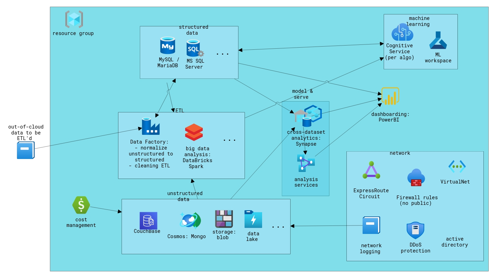

# sentia-data-engineering-assignment
see https://github.com/sentialabs/Data-Engineering

## Design

### Cloud choice

We note that requirement-wise, the inclusion of Microsoft PowerBI means that
we will at the very least require Microsoft Azure for our cloud setup.
It appears that presently our client's requirements
can be met without adding additional cloud providers,
so to simplify our PoC we will presently use just Azure.

### Infrastructure as Code

However, our client has indicated that requirements may evolve over time,
so with that in mind, as well as to reduce vendor lock-in,
we will opt to implement our infrastructure-as-code PoC
using a cloud-agnostic tool, [Terraform](https://www.terraform.io/).

### Cloud infra design

[CloudSkew](https://cloudskew.com/) Design diagram:

## Setup Instructions

- [Download and install](https://www.terraform.io/downloads.html) Terraform.
- [Download and install](https://docs.microsoft.com/en-us/cli/azure/install-azure-cli) the Azure CLI.
- Use `terraform login` to log in to Terraform Cloud,
as a way to store state for and collaborate on Terraform projects.
- Log in to [Terraform Cloud](https://app.terraform.io/) --
if the workspace has not been set up,
set your Azure credentials in its environment variables as described in the
[Terraform Azure guide](https://learn.hashicorp.com/tutorials/terraform/azure-remote?in=terraform/azure-get-started#configure-a-service-principal).
- In this GitHub repository ensure the secrets required for the [Terraform Github Action](https://github.com/marketplace/actions/hashicorp-setup-terraform) are set.
- [Pass values](https://www.terraform.io/docs/language/values/variables.html#assigning-values-to-root-module-variables) for variables listed in `variables.tf`, e.g. by renaming `terraform.auto.tfvars.example` to `terraform.auto.tfvars` and filling its contents, adding additional variable values as needed.

## Usage

- Initialize a new or existing Terraform configuration:
  `terraform init`

- Verify that the configuration files are syntactically valid:
  `terraform validate`

- Generate and show an execution plan:
  `terraform plan`

- Build or change infrastructure:
  `terraform apply`

- Destroy Terraform-managed infrastructure:
  `terraform destroy`
